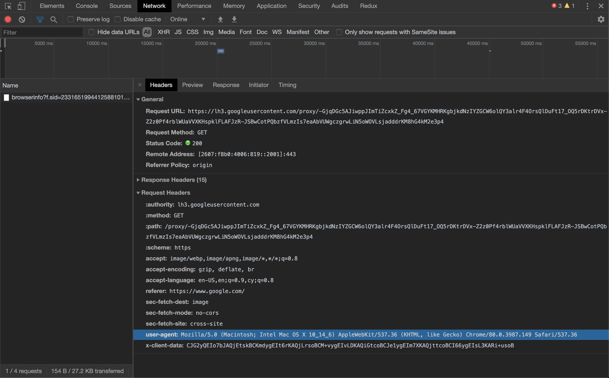

# Unit 5: Online-Chatroom

## Summary
In your skillbuilder, you used an asynchronous request to retrieve calendar data and then used that data to populate the DOM so that the user could view their calendar entries. Now, we're going to use even more asynchronous requests so that you can develop a deeper understanding and familiarity with asynchronous code. If you remember one thing from this unit, remember that [AJAX](https://en.wikipedia.org/wiki/Ajax_(programming)) (asynchronous JavaScript and XML) allows the browser to communicate with a foreign server without reloading the page.


Imagine if on Slack the entire page had to refresh every time a new message was posted - that's crazy. Prior to AJAX the browser would need to refresh the page in order to change. With AJAX, we can send a request to the server and - when the server responds - we can modify the page dynamically with JavaScript.

## How do I get started
As usual, there will be some setup involved before you can get started.

- [ ] As usual, fork and clone this repo.

- [ ] Next, use the following command to install any new npm dependencies:
```
npm install
```

- [ ] Start your server by running:
```
npm start
```

- [ ] Visit http://localhost:3000 to view your index.html page

### Request
Every asynchronous request is at its core an HTTP request. The browser sends a `request` object to the server with information regarding the broswer's intention with the server. There are major request types (or methods) that provide valuable information about the browsers intention:

- GET
- POST
- PUT
- DELETE

**GET** requests are primarily used for fetching data from a the server. For example, when you load Faceboook, your browser is making a GET request for all of your friends' latest post to populate the news feed. **POST** requests are used to provide data to the server. Whenever you are using Facebook messengers, and you send a message - a POST request is being made by your browser to add your message the server. **PUT** requests are used to update data on the server. **DELETE** requests inform the server that some data needs to be deleted.

### HTTP Headers


In addition to the request **method**, the browser may provide additional information and instructions about its request in the form of **[request headers](https://en.wikipedia.org/wiki/List_of_HTTP_header_fields)**.

A few examples of what is provided in the HTTP headers:

- **Accept:** Informs the server what file type the browser expects to receive back from the server
- **User-Agent:** Information about the method at which the browser is communicating with the server


## Challenges
- [ ] Create an area in your HTML where chat messages can be displayed. You may create this area either statically (editing your index.html file directly), dynamically (by interacting with the DOM using JavaScript in main.js), or with a combination of the two.

- [ ] Retrieve the list of messages from our messaging server by making a **GET** request to the following URI: <br>```https://ohwuvawrw4.execute-api.us-west-2.amazonaws.com/messages```

- [ ] Using JavaScript, populate your messages area with the list of messages retrieved via the AJAX request.


- [ ] Create a text input and submit button where users of your chatroom can enter and submit their messages.


- [ ] Post messages to the server by making a **POST** request to the same URI as above. Include a **body** with your AJAX request that includes information about your message. The body should contain the properties `created_by` and `message`. The server is expecting the body of the POST request to be encoded as **JSON**.  
	- *Hint: you may need to tell the server what type of data you're sending over*

Below is a sample message:

```javascript
{
  created_by: "Alex Zai",
  message: "Sample message"
}
```

### How do I test if my answer is correct?

Because there are so many approaches to this application, YOU will be the test suite. Interact with your application to see if it is doing what you want it to do. Don't forget to use console.log()s intelligently as a debugging tool.
